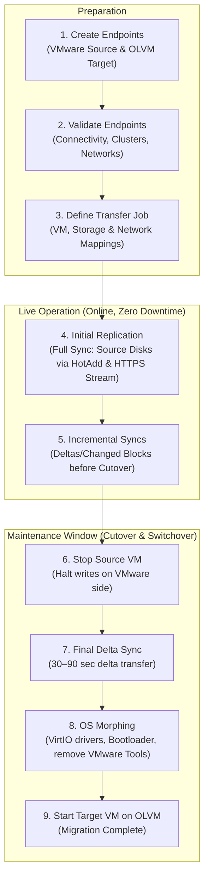

# VMware vSphere → Oracle OLVM Migration — REST API Guide

This guide describes the end-to-end virtual machine migration process from **VMware vSphere** to **Oracle Linux Virtualization Manager (OLVM / oVirt)** using the Coriolis / CloudShift REST API (`http://<coriolis-host>:7667/v1`).

---

## 1. Migration Workflow & Phases



---

## 2. API Base & Authentication

- **Base URL:** `http://<coriolis-host>:7667/v1` (Default Port: `7667`)
- **Headers:**
  - `Content-Type: application/json`
  - `Accept: application/json`
  - `X-Auth-Token: <token>` *(In standalone/no-auth mode, any dummy token like `fake-admin-token` suffices)*

---

## 3. Step-by-Step API Reference

### Step 1: Create Endpoints

#### 1.1 Source Endpoint (VMware vSphere)
Registers the VMware vCenter instance as the migration source.

**Request:**
```bash
curl -s -X POST "http://localhost:7667/v1/endpoints" \
  -H "Content-Type: application/json" \
  -H "X-Auth-Token: fake-admin-token" \
  -d '{
    "endpoint": {
      "name": "vsphere-source",
      "type": "vmware_vsphere",
      "description": "VMware vCenter Source Environment",
      "connection_info": {
        "host": "vc-mgc.sdn.it.internal",
        "username": "administrator@vsphere.local",
        "password": "SecretPassword123!",
        "allow_untrusted": true
      }
    }
  }'
```

**Response (`201 Created`):**
```json
{
  "endpoint": {
    "id": "e8a14b62-9f33-4c91-bdf1-123456789abc",
    "name": "vsphere-source",
    "type": "vmware_vsphere",
    "description": "VMware vCenter Source Environment",
    "created_at": "2026-09-17T18:00:00.000000",
    "updated_at": null
  }
}
```

---

#### 1.2 Target Endpoint (Oracle OLVM / oVirt)
Registers the OLVM Engine as the migration destination.

**Request:**
```bash
curl -s -X POST "http://localhost:7667/v1/endpoints" \
  -H "Content-Type: application/json" \
  -H "X-Auth-Token: fake-admin-token" \
  -d '{
    "endpoint": {
      "name": "olvm-target",
      "type": "olvm",
      "description": "Oracle OLVM Target Environment",
      "connection_info": {
        "url": "https://sb-ovirt.sdn.it.internal/ovirt-engine/",
        "username": "admin@internal",
        "password": "TargetSecret123!",
        "insecure": true
      }
    }
  }'
```

**Response (`201 Created`):**
```json
{
  "endpoint": {
    "id": "f9b25c73-0a44-4d02-cef2-987654321def",
    "name": "olvm-target",
    "type": "olvm",
    "description": "Oracle OLVM Target Environment",
    "created_at": "2026-09-17T18:01:00.000000",
    "updated_at": null
  }
}
```

---

#### 1.3 Validate Endpoint Connection (Optional)
Verifies network connectivity and authentication against the hypervisor API.

**Request:**
```bash
curl -s -X POST "http://localhost:7667/v1/endpoints/e8a14b62-9f33-4c91-bdf1-123456789abc/connection_info/validate" \
  -H "X-Auth-Token: fake-admin-token"
```

**Response (`200 OK`):**
```json
{
  "valid": true,
  "message": "Connection successfully established."
}
```

---

### Step 2: Define Transfer Job

Configures the migration parameters: which VM to replicate, target cluster ID, storage domain, and network mapping.

**Request:**
```bash
curl -s -X POST "http://localhost:7667/v1/transfers" \
  -H "Content-Type: application/json" \
  -H "X-Auth-Token: fake-admin-token" \
  -d '{
    "transfer": {
      "name": "migration-sbl13155t",
      "scenario": "replica",
      "origin_endpoint_id": "e8a14b62-9f33-4c91-bdf1-123456789abc",
      "destination_endpoint_id": "f9b25c73-0a44-4d02-cef2-987654321def",
      "instances": ["sbl13155t"],
      "source_environment": {
        "shutdown_instances": true
      },
      "destination_environment": {
        "cluster_id": "00000001-0001-0001-0001-00000000021a",
        "storage_domain_id": "00000002-0002-0002-0002-0000000001bc",
        "network_map": {
          "VM Network": "00000003-0003-0003-0003-0000000003cd"
        }
      }
    }
  }'
```

**Response (`201 Created`):**
```json
{
  "transfer": {
    "id": "cb44cbdc-1d3a-4e06-a668-8d2125460e66",
    "name": "migration-sbl13155t",
    "scenario": "replica",
    "instances": ["sbl13155t"],
    "origin_endpoint_id": "e8a14b62-9f33-4c91-bdf1-123456789abc",
    "destination_endpoint_id": "f9b25c73-0a44-4d02-cef2-987654321def",
    "status": "NOT_EXECUTED",
    "executions": []
  }
}
```

---

### Step 3: Initial Full Replication

Triggers the initial baseline copy while the source VM remains active and online.

**Request:**
```bash
curl -s -X POST "http://localhost:7667/v1/transfers/cb44cbdc-1d3a-4e06-a668-8d2125460e66/executions" \
  -H "Content-Type: application/json" \
  -H "X-Auth-Token: fake-admin-token" \
  -d '{"execution": {}}'
```

**Response (`201 Created`):**
```json
{
  "execution": {
    "id": "7134deaa-7d52-4e01-92b8-936618e4726b",
    "transfer_id": "cb44cbdc-1d3a-4e06-a668-8d2125460e66",
    "status": "PENDING",
    "tasks": [
      {"name": "CREATE_SOURCE_SNAPSHOT", "status": "PENDING"},
      {"name": "ATTACH_SOURCE_DISKS", "status": "PENDING"},
      {"name": "DEPLOY_TARGET_RESOURCES", "status": "PENDING"},
      {"name": "REPLICATE_DISKS", "status": "PENDING"},
      {"name": "DELETE_TRANSFER_SOURCE_RESOURCES", "status": "PENDING"},
      {"name": "DELETE_TRANSFER_TARGET_RESOURCES", "status": "PENDING"}
    ]
  }
}
```

#### Query Execution Progress:
```bash
curl -s "http://localhost:7667/v1/transfers/cb44cbdc-1d3a-4e06-a668-8d2125460e66/executions/7134deaa-7d52-4e01-92b8-936618e4726b" \
  -H "X-Auth-Token: fake-admin-token"
```

**Running Response (`200 OK`):**
```json
{
  "execution": {
    "id": "7134deaa-7d52-4e01-92b8-936618e4726b",
    "status": "RUNNING",
    "tasks": [
      {"name": "CREATE_SOURCE_SNAPSHOT", "status": "COMPLETED"},
      {"name": "ATTACH_SOURCE_DISKS", "status": "COMPLETED"},
      {"name": "DEPLOY_TARGET_RESOURCES", "status": "COMPLETED"},
      {
        "name": "REPLICATE_DISKS",
        "status": "RUNNING",
        "progress": {
          "percentage": 72,
          "message": "Replicating changed data for disk \"2000\" (written chunks: 14250.00 MB)"
        }
      },
      {"name": "DELETE_TRANSFER_SOURCE_RESOURCES", "status": "PENDING"},
      {"name": "DELETE_TRANSFER_TARGET_RESOURCES", "status": "PENDING"}
    ]
  }
}
```

Once completed, the execution status switches to **`COMPLETED`**.

---

### Step 4: Incremental Replications (Online Deltas)

Prior to entering the scheduled maintenance window, run one or more incremental syncs. Coriolis CBT (Changed Block Tracking) replicates only modified blocks, keeping runtime brief (typically 30–90 seconds). The source VM remains online (`shutdown_instances: false` is the default).

**Request:**
```bash
curl -s -X POST "http://localhost:7667/v1/transfers/cb44cbdc-1d3a-4e06-a668-8d2125460e66/executions" \
  -H "Content-Type: application/json" \
  -H "X-Auth-Token: fake-admin-token" \
  -d '{"execution": {}}'
```

---

### Step 5: Cutover (Final Sync, Guest Shutdown & Deployment)

Two operational patterns exist for cutover:

#### Option A (Recommended): One-Shot Automated Cutover
Specifying `"shutdown_instances": true` and `"auto_deploy": true` executes the entire cutover sequentially:
1. **`SHUTDOWN_INSTANCE`:** Gracefully stops the source VM via `vm.ShutdownGuest()` (VMware Tools).
2. **`REPLICATE_DISKS`:** Replicates the final incremental delta with the VM powered off (guaranteeing transaction consistency).
3. **`DEPLOYMENT`:** Immediately triggers OS morphing, attaches disks, and boots the target VM on OLVM.

**Request:**
```bash
curl -s -X POST "http://localhost:7667/v1/transfers/cb44cbdc-1d3a-4e06-a668-8d2125460e66/executions" \
  -H "Content-Type: application/json" \
  -H "X-Auth-Token: fake-admin-token" \
  -d '{
    "execution": {
      "shutdown_instances": true,
      "auto_deploy": true
    }
  }'
```

---

#### Option B: Decoupled Workflow (Separate Final Sync and Deployment)

**1. Trigger final sync with source VM shutdown:**
```bash
curl -s -X POST "http://localhost:7667/v1/transfers/cb44cbdc-1d3a-4e06-a668-8d2125460e66/executions" \
  -H "Content-Type: application/json" \
  -H "X-Auth-Token: fake-admin-token" \
  -d '{
    "execution": {
      "shutdown_instances": true
    }
  }'
```

**2. Once execution finishes, trigger deployment:**
```bash
curl -s -X POST "http://localhost:7667/v1/transfers/cb44cbdc-1d3a-4e06-a668-8d2125460e66/deployments" \
  -H "Content-Type: application/json" \
  -H "X-Auth-Token: fake-admin-token" \
  -d '{
    "deployment": {
      "skip_os_morphing": false,
      "clone_disks": false
    }
  }'
```

> [!TIP]
> **Best Practice for `clone_disks`:**
> - `"clone_disks": false` (Recommended): Attaches replicated disks directly to the target VM. Cutover completes in seconds without consuming duplicate storage.
> - `"clone_disks": true`: Clones replicated disks before booting. Keeps the replica disk as a rollback point, but requires storage copy time and capacity.

---

### Check Deployment Status:
```bash
curl -s "http://localhost:7667/v1/transfers/cb44cbdc-1d3a-4e06-a668-8d2125460e66/deployments/<DEPLOYMENT_ID>" \
  -H "X-Auth-Token: fake-admin-token"
```

**Successful Deployment Response (`200 OK`):**
```json
{
  "deployment": {
    "id": "3bb67ef1-5a22-4819-8671-11882299aa33",
    "status": "COMPLETED",
    "created_at": "2026-09-17T18:30:00.000000",
    "updated_at": "2026-09-17T18:33:45.000000",
    "target_instances": [
      {
        "name": "sbl13155t",
        "id": "c71a39f0-29a3-41bb-9271-8899aabbccdd",
        "status": "UP"
      }
    ]
  }
}
```

---

## 4. What Coriolis Does During OS Morphing (The 5 Core Tasks)

During the cutover phase, a temporary OS morphing minion VM mounts the replicated disk partitions and executes the following transformations via `chroot`:

1. **Install and enable QEMU Guest Agent (`qemu-guest-agent`):**
   - Installs `qemu-guest-agent` and enables it via `systemctl enable --now qemu-guest-agent`.
   - **Why it matters:** Allows the OLVM web portal to query the VM's IP address, monitor RAM usage, and coordinate graceful power operations.

2. **Remove VMware Tools:**
   - Uninstalls `open-vm-tools` and proprietary VMware daemons to prevent driver conflicts under KVM.

3. **Inject VirtIO Storage & Network Drivers into `initramfs` (Dracut):**
   - Ensures `virtio_scsi`, `virtio_blk`, `virtio_pci`, and `virtio_net` modules are included in the initial ramdisk.
   - Prevents boot-time kernel panics when accessing KVM storage.

4. **Migrate Network Interface Configurations:**
   - Rewrites network configuration files (NetworkManager / `ifcfg` scripts) from VMware `vmxnet3` interfaces to KVM VirtIO interfaces, preserving DHCP or static IP settings.

5. **Update Bootloader (GRUB2 / UEFI):**
   - Runs `grub2-mkconfig` to ensure GRUB boots from VirtIO drive IDs.

> [!IMPORTANT]
> **OLVM Cluster CPU Requirement (`x86-64-v3`):**  
> Because Coriolis executes guest commands via `chroot` using the target OS binaries (e.g. Oracle Linux 9 / RHEL 9), the OLVM cluster (e.g. `sb1`) must provide a virtual CPU model supporting at least `x86-64-v3` (AVX/AVX2 support, such as Intel Skylake, CascadeLake, IceLake, or AMD EPYC). A cluster CPU level set to legacy models will cause `glibc` to abort with `Fatal glibc error: CPU does not support x86-64-v3`.

---

## 5. Disk Naming in OLVM (oVirt)

Virtual disks on OLVM storage domains are named according to the following conventions:

1. **During Replication (Replica Disks):**
   - Pattern: `coriolis-<VM_NAME>-<DISK_ID>`
   - Example: `coriolis-sbl13155t-disk-2000`
   - *Purpose:* Prevents naming collisions in the storage pool and provides clear ownership tracking.

2. **Target VM Disks Post-Deployment:**
   - **When `clone_disks: false` (Recommended):** The replica disk is attached directly.
   - **When `clone_disks: true`:** Clones are automatically named:
     - Pattern: `<VM_NAME>_<DISK_ID>`
     - Example: `sbl13155t_disk-2000` (instead of random hashes like `clone-b707c622`).
   - *Note:* Display names can also be renamed at any time in the OLVM portal (*Compute $\rightarrow$ Virtual Machines $\rightarrow$ Disks $\rightarrow$ Edit*).

---

## 6. Bandwidth & Duration Calculation from Logs

Coriolis logs exact byte counts and timestamps in worker logs (`podman logs coriolis-worker`):

- **Logged Volume:**
  ```text
  Replicating changed data for disk "2000" (written chunks: 14250.00 MB)
  ```
- **Duration:**
  $$\Delta t = t_{\text{End}} - t_{\text{Start}} \quad (\text{seconds})$$
- **Throughput & Network Bandwidth:**
  $$\text{Throughput (MB/s)} = \frac{\text{Data in MB}}{\Delta t}$$
  $$\text{Bandwidth (Mbit/s)} = \text{Throughput (MB/s)} \times 8$$

*Example:* $14,250 \text{ MB}$ transferred in $285 \text{ s}$ equals **$50 \text{ MB/s}$** or **$400 \text{ Mbit/s}$**.

---

## 7. Rollback Strategy

The source VM in VMware vCenter is **never deleted**; it remains in the **`Powered Off`** state.

In the event a rollback is required:
1. Power off the target VM in OLVM.
2. Power on the original VM in vCenter (`Power On`).
3. Validate services — the VM is immediately online with its exact state at the moment of cutover.
