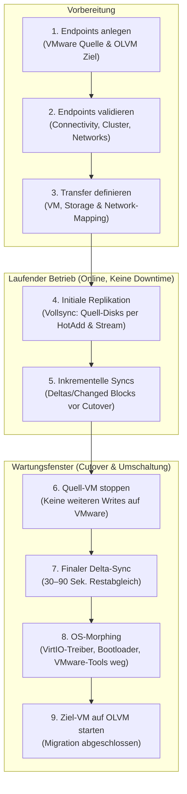

# VMware vSphere → Oracle OLVM Migration — REST API Guide

Dieser Leitfaden beschreibt den vollständigen Migrationsprozess von **VMware vSphere** zu **Oracle Linux Virtualization Manager (OLVM / oVirt)** über die Coriolis / CloudShift REST-API (`http://<coriolis-host>:7667/v1`).

---

## 1. Migrations-Workflow & Phasen



---

## 2. API-Basis & Authentifizierung

- **Basis-URL:** `http://<coriolis-host>:7667/v1` (Default-Port: `7667`)
- **Headers:**
  - `Content-Type: application/json`
  - `Accept: application/json`
  - `X-Auth-Token: <token>` *(In Dev/No-Auth Pipeline genügt ein beliebiger String wie `fake-admin-token`)*

---

## 3. Schritt-für-Schritt API-Referenz

### Schritt 1: Endpoints anlegen

#### 1.1 Quell-Endpoint (VMware vSphere)
Registriert das VMware vCenter als Export-Quelle.

**Request:**
```bash
curl -s -X POST "http://localhost:7667/v1/endpoints" \
  -H "Content-Type: application/json" \
  -H "X-Auth-Token: fake-admin-token" \
  -d '{
    "endpoint": {
      "name": "vsphere-source",
      "type": "vmware_vsphere",
      "description": "VMware vCenter Quellumgebung",
      "connection_info": {
        "host": "vc-mgc.sdn.it.internal",
        "username": "administrator@vsphere.local",
        "password": "SecretPassword123!",
        "allow_untrusted": true
      }
    }
  }'
```

**Response (`201 Created`):**
```json
{
  "endpoint": {
    "id": "e8a14b62-9f33-4c91-bdf1-123456789abc",
    "name": "vsphere-source",
    "type": "vmware_vsphere",
    "description": "VMware vCenter Quellumgebung",
    "created_at": "2026-09-17T18:00:00.000000",
    "updated_at": null
  }
}
```

---

#### 1.2 Ziel-Endpoint (Oracle OLVM / oVirt)
Registriert die OLVM-Engine als Import-Ziel.

**Request:**
```bash
curl -s -X POST "http://localhost:7667/v1/endpoints" \
  -H "Content-Type: application/json" \
  -H "X-Auth-Token: fake-admin-token" \
  -d '{
    "endpoint": {
      "name": "olvm-target",
      "type": "olvm",
      "description": "Oracle OLVM Zielumgebung",
      "connection_info": {
        "url": "https://sb-ovirt.sdn.it.internal/ovirt-engine/",
        "username": "admin@internal",
        "password": "TargetSecret123!",
        "insecure": true
      }
    }
  }'
```

**Response (`201 Created`):**
```json
{
  "endpoint": {
    "id": "f9b25c73-0a44-4d02-cef2-987654321def",
    "name": "olvm-target",
    "type": "olvm",
    "description": "Oracle OLVM Zielumgebung",
    "created_at": "2026-09-17T18:01:00.000000",
    "updated_at": null
  }
}
```

---

#### 1.3 Verbindung validieren (optional)
Prüft die Credentials und Netzwerk-Erreichbarkeit der Endpoints.

**Request:**
```bash
curl -s -X POST "http://localhost:7667/v1/endpoints/e8a14b62-9f33-4c91-bdf1-123456789abc/connection_info/validate" \
  -H "X-Auth-Token: fake-admin-token"
```

**Response (`200 OK`):**
```json
{
  "valid": true,
  "message": "Connection successfully established."
}
```

---

### Schritt 2: Replikations-Job (Transfer) anlegen

Definiert das Migrations-Mapping: Welche VM soll von VMware in welches OLVM-Cluster, auf welche Storage-Domain und in welches Netzwerk migriert werden?

**Request:**
```bash
curl -s -X POST "http://localhost:7667/v1/transfers" \
  -H "Content-Type: application/json" \
  -H "X-Auth-Token: fake-admin-token" \
  -d '{
    "transfer": {
      "name": "migration-sbl13155t",
      "scenario": "replica",
      "origin_endpoint_id": "e8a14b62-9f33-4c91-bdf1-123456789abc",
      "destination_endpoint_id": "f9b25c73-0a44-4d02-cef2-987654321def",
      "instances": ["sbl13155t"],
      "source_environment": {
        "shutdown_instances": true
      },
      "destination_environment": {
        "cluster_id": "00000001-0001-0001-0001-00000000021a",
        "storage_domain_id": "00000002-0002-0002-0002-0000000001bc",
        "network_map": {
          "VM Network": "00000003-0003-0003-0003-0000000003cd"
        }
      }
    }
  }'
```

**Response (`201 Created`):**
```json
{
  "transfer": {
    "id": "cb44cbdc-1d3a-4e06-a668-8d2125460e66",
    "name": "migration-sbl13155t",
    "scenario": "replica",
    "instances": ["sbl13155t"],
    "origin_endpoint_id": "e8a14b62-9f33-4c91-bdf1-123456789abc",
    "destination_endpoint_id": "f9b25c73-0a44-4d02-cef2-987654321def",
    "status": "NOT_EXECUTED",
    "executions": []
  }
}
```

---

### Schritt 3: Initiale Replikation (Vollsync)

Startet die erste Datenübertragung im laufenden Betrieb der Quell-VM.

**Request:**
```bash
curl -s -X POST "http://localhost:7667/v1/transfers/cb44cbdc-1d3a-4e06-a668-8d2125460e66/executions" \
  -H "Content-Type: application/json" \
  -H "X-Auth-Token: fake-admin-token" \
  -d '{"execution": {}}'
```

**Response (`201 Created`):**
```json
{
  "execution": {
    "id": "7134deaa-7d52-4e01-92b8-936618e4726b",
    "transfer_id": "cb44cbdc-1d3a-4e06-a668-8d2125460e66",
    "status": "PENDING",
    "tasks": [
      {"name": "CREATE_SOURCE_SNAPSHOT", "status": "PENDING"},
      {"name": "ATTACH_SOURCE_DISKS", "status": "PENDING"},
      {"name": "DEPLOY_TARGET_RESOURCES", "status": "PENDING"},
      {"name": "REPLICATE_DISKS", "status": "PENDING"},
      {"name": "DELETE_TRANSFER_SOURCE_RESOURCES", "status": "PENDING"},
      {"name": "DELETE_TRANSFER_TARGET_RESOURCES", "status": "PENDING"}
    ]
  }
}
```

#### Status & Fortschritt abfragen:
```bash
curl -s "http://localhost:7667/v1/transfers/cb44cbdc-1d3a-4e06-a668-8d2125460e66/executions/7134deaa-7d52-4e01-92b8-936618e4726b" \
  -H "X-Auth-Token: fake-admin-token"
```

**Response während des Laufs (`200 OK`):**
```json
{
  "execution": {
    "id": "7134deaa-7d52-4e01-92b8-936618e4726b",
    "status": "RUNNING",
    "tasks": [
      {"name": "CREATE_SOURCE_SNAPSHOT", "status": "COMPLETED"},
      {"name": "ATTACH_SOURCE_DISKS", "status": "COMPLETED"},
      {"name": "DEPLOY_TARGET_RESOURCES", "status": "COMPLETED"},
      {
        "name": "REPLICATE_DISKS",
        "status": "RUNNING",
        "progress": {
          "percentage": 72,
          "message": "Replicating changed data for disk \"2000\" (written chunks: 14250.00 MB)"
        }
      },
      {"name": "DELETE_TRANSFER_SOURCE_RESOURCES", "status": "PENDING"},
      {"name": "DELETE_TRANSFER_TARGET_RESOURCES", "status": "PENDING"}
    ]
  }
}
```

Sobald abgeschlossen, steht der Status auf **`COMPLETED`**.

---

### Schritt 4: Inkrementelle Replikationen (Deltas im laufenden Betrieb)

Vor dem eigentlichen Wartungsfenster stößt man weitere Executions an. Da Coriolis CBT (Changed Block Tracking) nutzt, werden nur Blöcke übertragen, die sich seit dem letzten Lauf geändert haben. Die Quell-VM läuft dabei ungestört weiter (`shutdown_instances: false` ist der Standard).

**Request:**
```bash
curl -s -X POST "http://localhost:7667/v1/transfers/cb44cbdc-1d3a-4e06-a668-8d2125460e66/executions" \
  -H "Content-Type: application/json" \
  -H "X-Auth-Token: fake-admin-token" \
  -d '{"execution": {}}'
```

*Dauer:* Häufig nur 30 bis 90 Sekunden.

---

### Schritt 5: Cutover (Finaler Sync, Shutdown & Deployment)

Für den eigentlichen Cutover gibt es zwei Wege:

#### Option A (Empfohlen): Vollautomatischer Cutover in einem Aufruf
Mit `"shutdown_instances": true` und `"auto_deploy": true` steuert Coriolis den gesamten Cutover vollautomatisch:
1. **`SHUTDOWN_INSTANCE`:** Fährt die Quell-VM auf VMware sauber über `vm.ShutdownGuest()` (VMware Tools) herunter.
2. **`REPLICATE_DISKS`:** Überträgt die letzten minimalen Deltas der gestoppten VM (100%ige Transaktionskonsistenz).
3. **`DEPLOYMENT`:** Startet direkt im Anschluss OS-Morphing und Boot auf OLVM.

**Request:**
```bash
curl -s -X POST "http://localhost:7667/v1/transfers/cb44cbdc-1d3a-4e06-a668-8d2125460e66/executions" \
  -H "Content-Type: application/json" \
  -H "X-Auth-Token: fake-admin-token" \
  -d '{
    "execution": {
      "shutdown_instances": true,
      "auto_deploy": true
    }
  }'
```

---

#### Option B: Geteilter Ablauf (Finaler Sync und Deployment getrennt)

**1. Finaler Sync mit Herunterfahren der Quell-VM:**
```bash
curl -s -X POST "http://localhost:7667/v1/transfers/cb44cbdc-1d3a-4e06-a668-8d2125460e66/executions" \
  -H "Content-Type: application/json" \
  -H "X-Auth-Token: fake-admin-token" \
  -d '{
    "execution": {
      "shutdown_instances": true
    }
  }'
```

**2. Nach Abschluss der Execution: Deployment anstoßen:**
```bash
curl -s -X POST "http://localhost:7667/v1/transfers/cb44cbdc-1d3a-4e06-a668-8d2125460e66/deployments" \
  -H "Content-Type: application/json" \
  -H "X-Auth-Token: fake-admin-token" \
  -d '{
    "deployment": {
      "skip_os_morphing": false,
      "clone_disks": false
    }
  }'
```

> [!TIP]
> **Tipp zu `clone_disks`:**
> - `"clone_disks": false` (Empfohlen): Verwendet direkt die replizierte Disk. Der Cutover ist in Sekunden abgeschlossen und verbraucht keinen doppelten Speicher.
> - `"clone_disks": true`: Klont die replizierte Disk vor dem Start. Das Original bleibt als Snapshot-Stand erhalten, erfordert jedoch Kopierzeit und zusätzlichen Storage.

---

### Deployment-Status abfragen:
```bash
curl -s "http://localhost:7667/v1/transfers/cb44cbdc-1d3a-4e06-a668-8d2125460e66/deployments/<DEPLOYMENT_ID>" \
  -H "X-Auth-Token: fake-admin-token"
```

**Finale Erfolgs-Response (`200 OK`):**
```json
{
  "deployment": {
    "id": "3bb67ef1-5a22-4819-8671-11882299aa33",
    "status": "COMPLETED",
    "created_at": "2026-09-17T18:30:00.000000",
    "updated_at": "2026-09-17T18:33:45.000000",
    "target_instances": [
      {
        "name": "sbl13155t",
        "id": "c71a39f0-29a3-41bb-9271-8899aabbccdd",
        "status": "UP"
      }
    ]
  }
}
```

---

## 4. Was Coriolis im OS-Morphing genau macht (Die 5 Kernaufgaben)

Während der Cutover-Phase führt der temporäre OS-Morphing-Minion per `chroot` auf den gemounteten Ziel-Festplatten vollautomatisch folgende 5 Anpassungen durch:

1. **KVM / QEMU Guest Agent (`qemu-guest-agent`) installieren & aktivieren:**
   - Installiert das Paket `qemu-guest-agent` und aktiviert den Dienst via `systemctl enable --now qemu-guest-agent`.
   - **Bedeutung für OLVM:** Erst dadurch kann OLVM im Web-Portal die IP-Adresse, Arbeitsspeicherauslastung und Systeminfos der VM anzeigen und Shutdown-/Reboot-Befehle sauber koordinieren.

2. **VMware Tools sauber entfernen:**
   - Deinstalliert `open-vm-tools` sowie proprietäre VMware-Tools-Reste und Agenten, um Treiberkonflikte und Log-Warnungen unter KVM zu verhindern.

3. **VirtIO-Storage- & Netzwerktreiber in `initramfs` (Dracut) einbinden:**
   - Stellt sicher, dass die KVM-Treiber `virtio_scsi`, `virtio_blk`, `virtio_pci` und `virtio_net` in der Boot-Ramdisk (`initramfs`) vorhanden sind.
   - Verhindert Kernel-Panics beim Booten auf OLVM.

4. **Netzwerk-Konfiguration migrieren:**
   - Passt Netzwerkkarten und Konfigurationen (NetworkManager / `ifcfg`) an: Die alten VMware `vmxnet3`-Schnittstellen werden auf KVM VirtIO-Schnittstellen umgeschrieben (inkl. DHCP oder statischer IP-Beibehaltung).

5. **Bootloader aktualisieren (GRUB2 / UEFI):**
   - Führt `grub2-mkconfig` aus und registriert die neuen Boot-Geräte, damit der Kernel direkt von den VirtIO-Disks startet.

> [!IMPORTANT]
> **CPU-Anforderung im OLVM-Cluster (`x86-64-v3`):**  
> Weil Coriolis Befehle per `chroot` direkt mit den Binaries des Ziel-Betriebssystems (z. B. Oracle Linux 9 / RHEL 9) ausführt, muss das OLVM-Cluster (z. B. `sb1`) bzw. die Minion-VM ein CPU-Modell besitzen, das den Befehlssatz der Ziel-VM unterstützt (mindestens `x86-64-v3` / AVX2, z. B. Intel Skylake, CascadeLake, IceLake oder AMD EPYC). Andernfalls bricht `glibc` mit `CPU does not support x86-64-v3` ab.

---

## 5. Festplatten-Benennung in OLVM (oVirt)

In OLVM werden die virtuellen Festplatten auf den Storage Domains mit folgenden Namen geführt:

1. **Während der Replikation (Replica Disks):**
   - Namensmuster: `coriolis-<VM_NAME>-<DISK_ID>`
   - Beispiel: `coriolis-sbl13155t-disk-2000`
   - *Zweck:* Eindeutige Kennzeichnung und Kollisionsschutz im OLVM Storage Pool während aktiver Syncs.

2. **Finale Festplatten nach dem Deployment:**
   - **Bei `clone_disks: false` (Empfohlen):** Die replizierte Platte wird direkt an die Ziel-VM angehängt.
   - **Bei `clone_disks: true`:** Der Klon wird automatisch sauber benannt als:
     - Namensmuster: `<VM_NAME>_<DISK_ID>`
     - Beispiel: `sbl13155t_disk-2000` (statt zufälliger kryptischer IDs wie `clone-b707c622`).
   - *Hinweis:* Der Anzeigename kann im OLVM Web-Portal (*Compute $\rightarrow$ Virtual Machines $\rightarrow$ Disks $\rightarrow$ Edit*) jederzeit nachträglich angepasst werden.

---

## 6. Bandbreiten- & Dauer-Kalkulation aus den Logs

In den Logs des Workers (`podman logs coriolis-worker`) werden Datenmengen und Zeiten festgehalten:

- **Geloggte Datenmenge:**
  ```text
  Replicating changed data for disk "2000" (written chunks: 14250.00 MB)
  ```
- **Dauer berechnen:**
  $$\Delta t = t_{\text{Ende}} - t_{\text{Start}} \quad (\text{Sekunden})$$
- **Durchsatz & Bandbreite:**
  $$\text{Durchsatz (MB/s)} = \frac{\text{Daten in MB}}{\Delta t}$$
  $$\text{Bandbreite (Mbit/s)} = \text{Durchsatz (MB/s)} \times 8$$

*Beispiel:* $14.250 \text{ MB}$ in $285 \text{ s}$ entspricht **$50 \text{ MB/s}$** bzw. **$400 \text{ Mbit/s}$**.

---

## 7. Rollback-Strategie

Die Quell-VM auf VMware wird **nicht gelöscht**, sondern verbleibt im Zustand **`Powered Off`**.

Falls ein Rollback nötig ist:
1. Ziel-VM auf OLVM herunterfahren.
2. Quell-VM auf VMware wieder einschalten (`Power On`).
3. Dienste prüfen – die VM ist sofort wieder auf dem Stand des Cutover-Zeitpunkts.
