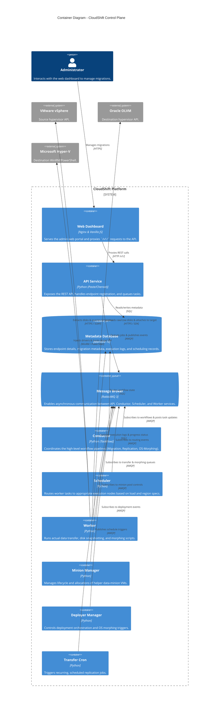

# C4 Container Diagram

This diagram displays the internal container architecture of CloudShift, showing how the decoupled services communicate via RabbitMQ and read/write metadata in MariaDB.

## Internal Communication Flows

1. **REST API Request**: The user triggers a migration on the Dashboard. Nginx routes it to `cloudshift-api`, which writes the migration record to MariaDB and publishes a start event to RabbitMQ.
2. **Workflow Orchestration**: `cloudshift-conductor` picks up the start event, initiates a `TaskFlow` engine pipeline, and posts subtasks (e.g. Export, Transfer, Morph) back onto RabbitMQ.
3. **Task Execution**:
   - `cloudshift-scheduler` routes the subtask to a specific worker.
   - `cloudshift-worker` starts execution, calling the VMware API to pull disk contents and sending data to the destination (OLVM or Hyper-V).
   - If importing to OLVM, `cloudshift-minion-manager` handles creation of the helper data-minion VM to attach and write the incoming disks.
   - Once transfer finishes, `cloudshift-deployer-manager` triggers OS-morphing (e.g. installing VirtIO drivers on Windows or updating initramfs on RedHat).
