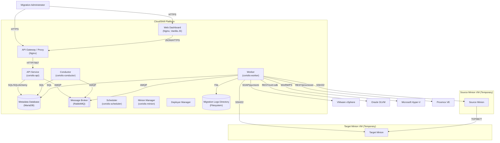

# C4 Container Diagram

This Container diagram details the internal microservices structure of the CloudShift (Coriolis) platform, showing how different services interact asynchronously and how they orchestrate the migration flow.

## Description of Containers

- **Web Dashboard**: An Nginx-hosted Single Page Application (SPA) providing visual status monitoring, target environment mapping, and endpoint administration.
- **API Gateway (Nginx)**: The entrypoint for all frontend API traffic. Performs reverse proxying and serves Swagger JSON schemas.
- **API Service (`coriolis-api`)**: A Flask/Paste-based REST service that validates requests, handles authorization, and communicates with the relational database and the queue broker.
- **Metadata Database (MariaDB)**: A relational database tracking active migrations, schedules, execution configurations, and worker assignments.
- **Message Broker (RabbitMQ)**: Facilitates inter-container RPC communications and queues migration workloads for concurrency.
- **Conductor (`coriolis-conductor`)**: Uses Python's TaskFlow library to run the state machines for replica creations, updates, and deployments.
- **Worker (`coriolis-worker`)**: Performs the heavy-lifting tasks (such as copying disks and applying operating system morphing).
- **Migration Logs Directory**: Path configured via `olvm.migration_log_dir` (defaults to `/var/log/coriolis/migrations/`) where execution times, stages, and status codes are logged into JSON-Lines documents per migration.
- **Temporary Minions**: Dedicated lightweight VMs spawned on the hypervisors to read/write disk sectors. Piped together securely on Port 6677.
