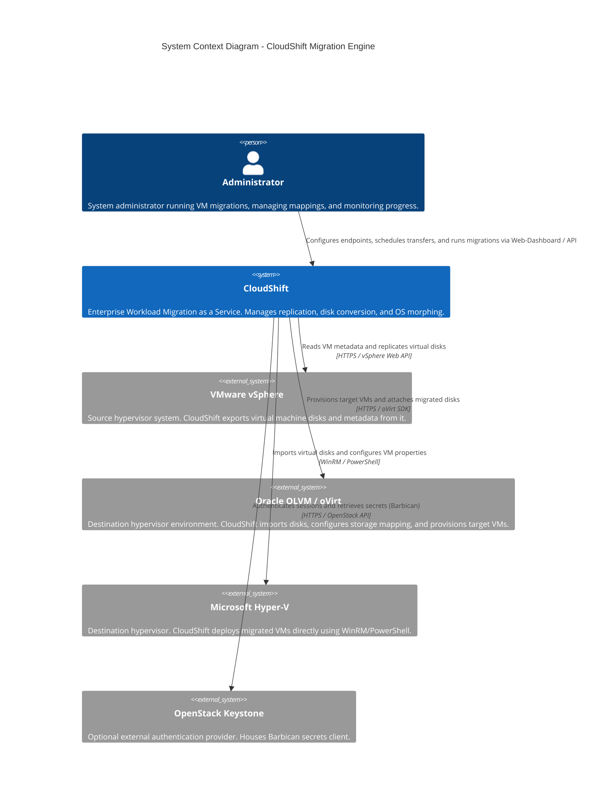

# C4 System Context Diagram

This diagram displays the high-level boundaries of the CloudShift migration platform, showing the primary users and external systems it interacts with.

## Relationships Description

1. **Administrator to CloudShift**: Communicates with the Control Plane using standard HTTP request payloads to manage endpoints, scenario mappings, and view active transfer executions.
2. **CloudShift to VMware vSphere**: Performs read-only queries to extract virtual machine definitions (CPU, RAM, NICs) and streams disk snapshots during replication.
3. **CloudShift to Oracle OLVM**: Authenticates with oVirt Engine, creates disk entities on target storage domains, uploads virtual disk layers, and spawns temporary minion VMs to process block/file adjustments.
4. **CloudShift to Microsoft Hyper-V**: Establishes secure WinRM sessions to run PowerShell scripts on the host to create VHDX files, configure virtual switches, and register imported VMs.
