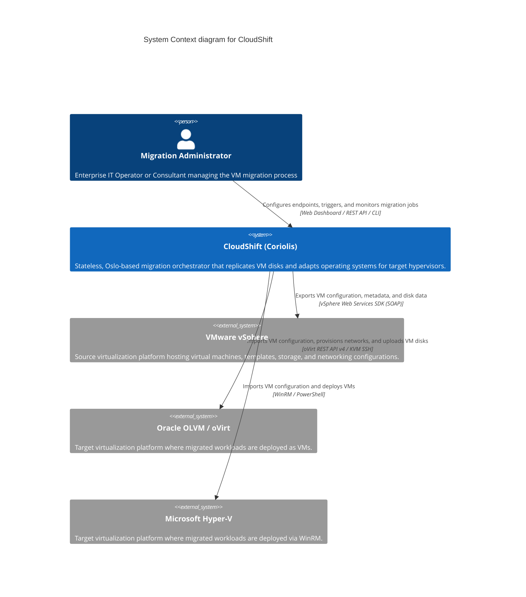

# C4 System Context Diagram

This System Context diagram provides a high-level overview of the CloudShift (Coriolis) migration engine, its users, and the external virtualization environments it integrates with.

## Key Interactions

1. **Migration Administrator**: Interacts with CloudShift via the Web Dashboard, REST API, or CLI to define connection secrets (vCenter/OLVM/Hyper-V credentials), map networks/storage, start migration jobs, and monitor replication progress.
2. **VMware vSphere (Source)**: CloudShift connects to the vCenter API to query VM properties, extract network details (including VLAN-IDs), and read raw disk data from ESXi datastores.
3. **Oracle OLVM / oVirt (Destination)**: CloudShift connects to the oVirt Engine API to define virtual machines, provision logical networks and VNIC profiles, and write disk data to destination storage domains.
4. **Microsoft Hyper-V (Destination)**: CloudShift connects to Hyper-V hosts using secure WinRM connections to construct target VMs, attach converted disks, and configure hypervisor settings.
