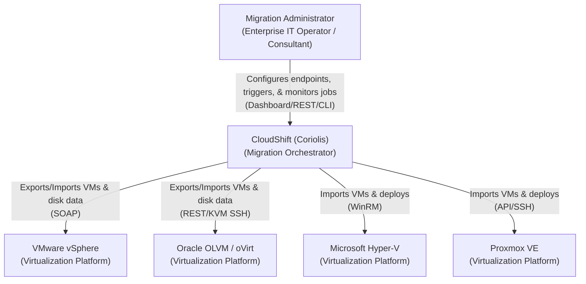

# C4 System Context Diagram

This System Context diagram provides a high-level overview of the CloudShift (Coriolis) migration engine, its users, and the external virtualization environments it integrates with.

## Key Interactions

1. **Migration Administrator**: Interacts with CloudShift via the Web Dashboard, REST API, or CLI to define connection secrets (vCenter/OLVM/Hyper-V/Proxmox credentials), map networks/storage, start migration jobs, and monitor replication progress.
2. **VMware vSphere**: CloudShift connects to the vCenter API to query VM properties, extract network details, read raw disk data from ESXi datastores, or write converted disks and configure VMs during target deployments.
3. **Oracle OLVM / oVirt**: CloudShift connects to the oVirt Engine API to export VM configurations and read disk blocks via Image Transfer APIs, or import VMs, provision logical networks, and write disk data to target storage domains.
4. **Microsoft Hyper-V**: CloudShift connects to Hyper-V hosts using secure WinRM connections to construct target VMs, attach converted disks, and configure hypervisor settings.
5. **Proxmox VE**: CloudShift connects to the PVE API using `proxmoxer` to clone templates, hot-attach target disks, write data sectors, and provision the final migrated VMs.
