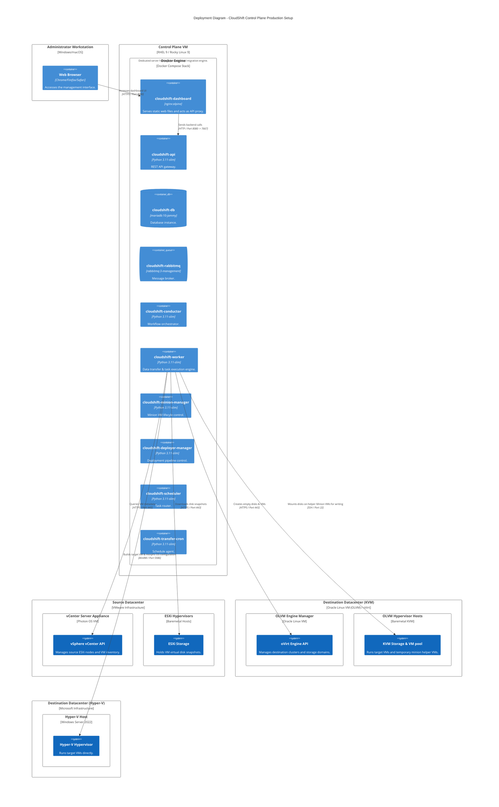

# C4 Deployment Diagram

This diagram displays the typical production deployment of the CloudShift Control Plane and its network topology relative to the source and target hypervisors.

## Network Considerations

1. **Firewall Allowances**:
   - The Control Plane VM must have outbound HTTPS (Port 443) access to both the VMware vCenter/ESXi hosts and the Oracle OLVM Engine.
   - Outbound SSH (Port 22) must be open from the Control Plane VM to the OLVM Hypervisor hosts (or the dynamic minion VM IPs) to mount and stream disk layers during replication.
   - Outbound WinRM (Port 5985/5986) must be allowed from the Control Plane VM to the target Microsoft Hyper-V hosts.
2. **Internal Proxying**:
   - The Nginx-based `cloudshift-dashboard` exposes port 8080 to the client web browser.
   - All REST requests to `/v1/` are dynamically proxied internally via the Docker network bridge to the `cloudshift-api` container on port 7667.
3. **Keystone & Barbican**:
   - For Keystone integration (if not in `noauth` mode), the API container requires outbound HTTPS access to the Keystone endpoint.
