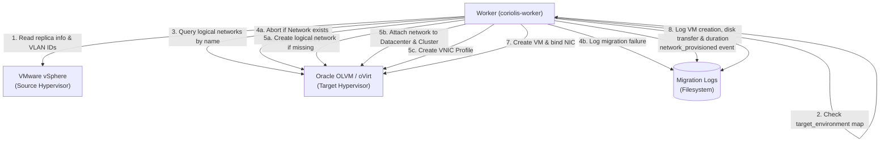

# C4 Dynamic Flow: Automated Network and VNIC Profile Provisioning

This Dynamic diagram illustrates the flow of automated logical network and VNIC profile creation in Oracle OLVM during a migration import task.

## Detail Flow Description

1. **VLAN Extraction**: During the VMware export phase, the `coriolis-worker` calls the vCenter SOAP API via `pyvmomi` to extract the network name and VLAN-ID for each virtual network interface card (NIC) attached to the source VM.
2. **Explicit Override Check**: Before performing auto-provisioning, the worker checks if the source network is explicitly mapped in the migration's `network_map` destination payload. If it is mapped, the auto-provisioning logic is bypassed.
3. **OLVM Network Lookup**: The worker queries the oVirt REST API to check if a logical network matching the source network name already exists in the destination Datacenter.
4. **VLAN Conflict Detection**: 
   - If the network exists but its VLAN-ID differs from the source VM network, the migration is **aborted immediately** with an `InvalidInput` exception. 
   - The failure event is logged to the per-migration log file inside `/var/log/coriolis/migrations/` and the task terminates to prevent network mismatches.
5. **Auto-Provisioning**:
   - If the network does not exist, the worker creates a logical network in OLVM with the matching VLAN-ID.
   - The logical network is attached to the target Datacenter and Cluster.
   - A VNIC profile is created under that logical network, inheriting the network's name.
6. **Logging and VM binding**:
   - A `network_provisioned` event is logged.
   - The worker creates the target VM and binds the NIC to the newly provisioned or existing VNIC profile.
   - Migration continues and records execution durations for VM creation, disk transfer, and final migration status.
